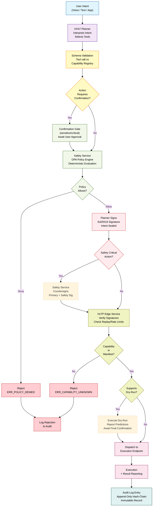
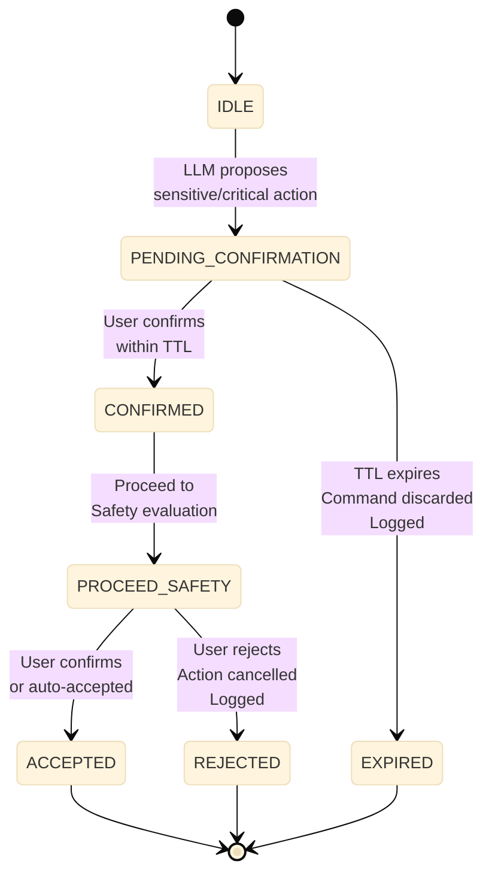

# The Authority Chain

Every execution event in the Hestia ecosystem follows a strict, non-negotiable authority chain. No step may be skipped. No component may invoke a downstream component without passing through the chain.

## Authority Flow Sequence

The following diagram shows how a command flows from user intent through validation, signing, and execution:

```mermaid
%%{init: {'theme': 'base', 'themeVariables': {'fontSize': '13px', 'primaryColor': '#e1f5ff', 'primaryBorderColor': '#01579b', 'lineColor': '#333333', 'tertiaryColor': '#ffffff'}}%%
sequenceDiagram
    participant User as User / HK-47
    participant HX47 as HX47 Planner
    participant ValEng as Validation Engine
    participant SafetySvc as Safety Service
    participant PlanneSigner as Planner Signer
    participant EdgeSvc as HxTP Edge Service
    participant Device as Helix Node

    User->>HX47: Raw intent ("turn on lights")
    activate HX47
    HX47->>HX47: Interpret intent, select tool
    HX47->>ValEng: Propose structured tool call<br/>(action, device, parameters)
    deactivate HX47

    activate ValEng
    ValEng->>ValEng: Stage 1-3: Validate schema,<br/>rate limits, auth
    ValEng->>ValEng: Stage 6: Verify action in<br/>device capability manifest
    
    alt Safety-Critical Action?
        ValEng->>User: Request confirmation (dry-run first)
        User->>ValEng: User confirms
    end
    
    ValEng->>SafetySvc: Evaluate against OPA policy
    deactivate ValEng

    activate SafetySvc
    SafetySvc->>SafetySvc: Evaluate Rego policy<br/>against intent
    alt Policy Allow?
        SafetySvc->>PlanneSigner: Policy passed, request signature
    else Policy Deny
        SafetySvc->>User: Action denied by policy
    end
    deactivate SafetySvc

    activate PlanneSigner
    PlanneSigner->>PlanneSigner: Sign intent with<br/>Planner private key
    PlanneSigner->>EdgeSvc: Return signed intent
    deactivate PlanneSigner

    alter Safety-Critical Requires Safety Signature
        activate SafetySvc
        SafetySvc->>SafetySvc: Generate countersignature<br/>with Safety private key
        SafetySvc->>EdgeSvc: Return countersignature
        deactivate SafetySvc
    end

    activate EdgeSvc
    EdgeSvc->>EdgeSvc: Stage 4-5, 9-11: Verify signatures,<br/>check replay/rate limits,<br/>route to device
    EdgeSvc->>Device: Forward signed command
    deactivate EdgeSvc

    activate Device
    Device->>Device: Verify Planner signature
    alt Safety-Critical?
        Device->>Device: Verify Safety signature
    end
    Device->>Device: Cross-reference action in<br/>capability manifest
    Device->>Device: Execute action
    Device->>EdgeSvc: Report result
    deactivate Device

    EdgeSvc->>EdgeSvc: Log to hash-chained<br/>audit log
    EdgeSvc->>User: Command succeeded
```

## Complete Authority Flow



## Authority Invariants

These are non-negotiable constraints that define how authority flows through the system:

**I1: The Planner Cannot Execute**  
The Planner (HX47 LLM) can only propose actions. It cannot sign them, it cannot dispatch them, it cannot verify their execution. It outputs structured tool calls to the deterministic engine. The deterministic engine is responsible for all downstream steps.

**I2: The Safety Service Cannot Propose**  
The Safety Service can only approve or reject. It does not generate intents, select tools, or evaluate their appropriateness. It evaluates policies against intents proposed by the Planner and countersigns valid ones.

**I3: The Edge Service Cannot Modify Intents**  
The Edge Service routes and validates signed intents. It cannot change the action, the parameters, the target device, or any other aspect of the intent. A modified intent fails signature verification and is rejected.

**I4: Execution Endpoints Reject Unsigned Commands**  
Helix Nodes and digital agents verify both Planner and Safety signatures before executing. A command missing either signature (for actions that require Safety countersignature) is rejected at the device level. Unsigned commands are never executed.

**I5: The LLM Cannot Sign**  
Cryptographic signing occurs only in the HxTP signing authority layer, after all validation gates pass. The signing function is not accessible to any code path that the LLM output flows through. The LLM has no access to signing keys.

**I6: Offline Does Not Bypass Authority**  
In offline mode, the local Safety proxy enforces policy from its cached bundle. Offline mode does not grant expanded authority. If anything, offline mode has reduced authority (the offline-authorized whitelist excludes critical-class actions).

**I7: Authority Cannot Be Delegated Upward**  
A spawned agent or component cannot hold or acquire broader authority than the component that spawned it. Authority flows downward only. A Specialist agent cannot execute actions the Planner is not authorized to execute.

## Authority Domains

### 1. HX47 Planner Domain

**Responsibilities:**
- Interpret user intent
- Select appropriate tools from the registered capability set
- Generate execution proposal (structured tool call)
- Provide context to the Safety service (what is being proposed, why)

**Authority Boundary:**
- Can propose: ✓
- Can sign: ✗
- Can execute: ✗
- Can modify policies: ✗
- Can access execution keys: ✗

**Key Constraint:** The LLM receives a per-request action enum constructed from the capability registry. It never sees actions for devices outside the request scope. It never constructs action names; it selects from the provided enum.

### 2. Deterministic Validation Engine Domain

**Responsibilities:**
- Validate LLM output against tool schema (JSON schema validation)
- Cross-check proposed actions against the capability registry action enum
- Implement confirmation state machine for sensitive/critical actions
- Request Policy evaluation from the Safety Service
- Construct properly-formatted HxTP intent envelopes

**Authority Boundary:**
- Can validate: ✓
- Can route to Safety Service: ✓
- Can sign on behalf of Planner: `[Planned — Not Implemented]` (currently uses JWT auth; Ed25519 Planner signing spec'd but not built)
- Can execute directly: ✗
- Can modify capability registry: ✗

**Key Constraint:** No step in the validation pipeline may be bypassed. The pipeline is not configurable at runtime.

**Current Implementation Status:** Commands currently use JWT Bearer token authentication. The specification requires Ed25519 Planner-signed intents for the formal Intent Service API. This signing layer is architectural direction but not yet implemented. See [API Reference](/api-reference/overview) for current REST auth details.

### 3. Safety Service Domain

**Responsibilities:**
- Evaluate proposed intents against OPA policy bundles
- Issue countersignatures for valid intents
- Maintain a separate Ed25519 signing key
- Reject intents that violate policy

**Authority Boundary:**
- Can evaluate policies: ✓
- Can countersign: ✓
- Can execute: ✗
- Can issue Policy changes unilaterally: ✗
- Can share signing key with Planner: ✗

**Key Constraint:** The Safety service is a separate trust domain. Its signing key is independent. Compromise of the Planner signing key does not compromise the Safety key.

### 4. HxTP Edge Service Domain

**Responsibilities:**
- Receive doubly-signed intents
- Verify both signatures (Planner + Safety, if required)
- Validate nonces and sequence numbers
- Check rate limits
- Dispatch to execution endpoints
- Coordinate dry-run phases
- Log all commands to the audit log

**Authority Boundary:**
- Can route signed intents: ✓
- Can verify signatures: ✓
- Can modify intents: ✗
- Can bypass validation: ✗
- Can execute on endpoints: ✗

**Key Constraint:** The Edge Service maintains nonce registry per device. It will not forward an intent with a replayed nonce.

### 5. Execution Endpoint Domain (Helix Nodes, HX100 Agents)

**Responsibilities:**
- Receive signed intent
- Verify signatures
- Execute action within declared capability boundary
- Report results atomically
- Timeout if callback exceeds maximum execution time

**Authority Boundary:**
- Can execute signed commands: ✓
- Can reject unsigned commands: ✓
- Can expand capability set: ✗
- Can modify policies: ✗
- Can bypass signature verification: ✗

**Key Constraint:** Execution endpoints will not accept commands from any source other than the authenticated HxTP Edge Service.

## Confirmation State Machine

For actions with `safety_class ∈ {sensitive, critical}`, the execution engine enters a confirmation state before Safety evaluation:



**Confirmation Properties:**
- **TTL:** Configurable per tenant. Default: 30 seconds for sensitive, 60 seconds for critical
- **Simultaneous Confirmations:** Each has an independent ID and TTL. The state machine tracks them independently
- **Expiry Behavior:** Expired confirmations are discarded and logged. The system does not retry automatically. The user must re-issue the intent

**Multi-Confirmation for Sequential Actions:**  
A multi-step plan requiring multiple sensitive/critical actions does not batch confirmations. Each action requiring confirmation is confirmed independently in sequence. An agent cannot obtain blanket confirmation for a plan.

## Safety Service Separation

The Safety service is **not a library function**. It is a separate microservice with its own Ed25519 signing key, separate deployment, and separate threat model.

**Why separate?**
1. **Trust Domain Isolation** — Compromise of the Planner does not compromise the Safety key
2. **Deterministic Evaluation** — Safety evaluation is not influenced by LLM reasoning or system state
3. **Policy Governance** — Safety policies can be updated independently of Planner deployment
4. **Auditability** — All Safety decisions are logged and signed

**How the Safety Service Works:**

1. Deterministic engine sends validated, Planner-signed intent to Safety Service
2. Safety Service evaluates intent against OPA policy bundle
3. If policy passes: Safety Service countersigns the intent and returns it
4. If policy denies: Safety Service rejects with `ERR_POLICY_DENIED`
5. Deterministic engine receives response and either dispatches to Edge Service or reports rejection to user

**Policy Evaluation Properties:**
- **Synchronous:** Under 10ms per evaluation on cached bundle
- **Deterministic:** Same input always produces same output
- **Context-Aware:** Policies can reference device ID, action, params, device state, time, user, etc.
- **Offline-Capable:** Cache bundles locally with TTL. For `time_sensitive` policies, fail closed if bundle TTL expired

See [Safety Enforcement](/architecture/safety-enforcement) for detailed policy model.

## Navigation

**Breadcrumb:** Architecture → Authority Chain  
**Status:** Specified ✓

### Related Topics

- [Capability Manifest](/architecture/capability-manifest) — What devices declare they can do; how the LLM sees actions
- [Safety Enforcement](/architecture/safety-enforcement) — OPA policy evaluation; how Safety Service countersigns
- [Dispatch Pipeline](/protocol/dispatch-pipeline) — What happens after signing; 12-stage validation at Edge Service
- [Trust Boundaries](/security/trust-boundaries) — Authority domains and signature validation points
- [Invariants](/security/invariants) — Rules that govern authority flow (I1-I7)

### Reading This Document

**If you want to understand:**

- **How commands are validated:** Read sections: Authority Flow Sequence, Complete Authority Flow, Authority Invariants
- **How the Safety Service works:** Read: Authority Domains section 3, Safety Service Separation
- **How the Planner's authority is limited:** Read: Authority Invariants (I1, I5), Authority Domains section 1
- **How to prevent the LLM from executing arbitrary commands:** Read: Confirmation State Machine, Safety Service Separation, Authority Domains sections 1-3

### Trace Through a Real Command

To understand the full flow:

1. User says "unlock the front door" → [Authority Flow Sequence Diagram](#authority-flow-sequence)
2. HX47 proposes the action → [Authority Domains section 1](#authority-domains)
3. Schema validates against capability registry → [Authority Domains section 2](#authority-domains)
4. Safety Service evaluates policy → [Authority Domains section 3](#authority-domains)
5. Planner signs intent → [Signing and Verification section](/security/cryptographic-model)
6. Edge Service routes to device → [Authority Domains section 4](#authority-domains)
7. Device verifies signature and executes → [Authority Domains section 5](#authority-domains)

### Next Topics

- **After reading this:** Go to [Capability Manifest](/architecture/capability-manifest) to understand how devices declare capabilities
- **For protocol details:** See [Dispatch Pipeline](/protocol/dispatch-pipeline) for the 12-stage validation pipeline
- **For security proof:** See [Threat Model](/security/threat-model) — Attack T-2 (compromised HX47) shows why this design prevents LLM bypass
- **For cryptographic details:** See [Cryptographic Model](/security/cryptographic-model) — How signatures are generated and verified
- **For operational context:** See [Execution Modes](/operations/execution-modes) — How this authority chain operates in Cloud/Local/Offline tiers
