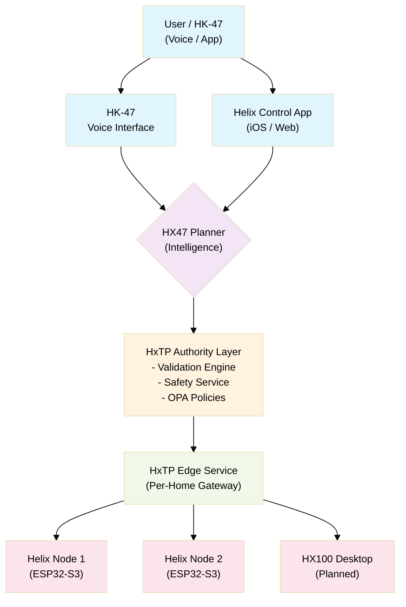
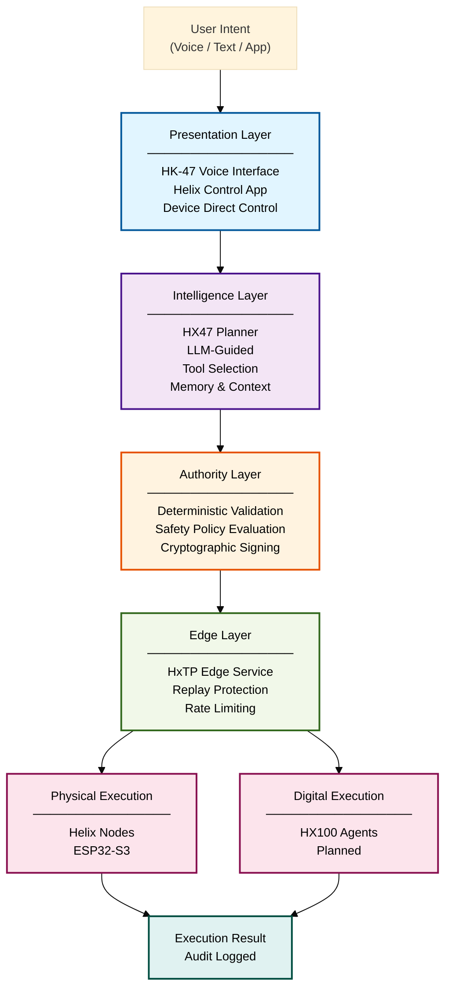

# Hestia Labs Architecture Overview

Hestia Labs is a capability-based, cryptographically signed execution platform that operates autonomously at the edge with optional cloud enhancement. It is designed for sovereign home automation where intelligence, authority, and execution are structurally separated.

## What This System Is

**Not** a chatbot with device integrations. **Not** a cloud-dependent assistant that requires Amazon or Google to work.

**Actually:** A sovereign, AI-native execution platform where:
- An LLM (HX47) proposes actions
- Deterministic systems validate those actions
- Cryptographic authority gates execution
- Physical devices execute only within strictly declared boundaries

The key insight: **Intelligence should propose. Authority should decide. Execution should happen.** These are separate. Never conflate them.

## Problem Statement

Today's smart home systems suffer from three fundamental problems:

1. **Unbounded Execution** — Voice assistants can execute arbitrary commands to arbitrary devices. "Disable all door locks" might work if the LLM thinks of it. There is no enforced boundary.

2. **Cloud Dependency** — Many systems require internet connectivity to function. Lose internet; your home stops responding to voice.

3. **Opaque Authority** — You can't tell why a command executed or didn't. The LLM output, the cloud decision, the local logic are all hidden.

Hestia Labs solves all three by enforcing:
- **Capability boundaries** (device declares what it can do, nothing else is allowed)
- **Local operation** (system works offline, cloud is optional)
- **Transparent authority** (every decision is auditable, signed, and logged)

## Core Principles

**1. Capability-Based Execution**

*What it is:* Every device declares upfront what it can do. Commands request capabilities, never raw operations.

*Why it exists:* Without this, an LLM could hypothetically execute anything (e.g., "rm -rf /" via SSH). With declared capabilities, the system can reject any request outside the boundary. The LLM can't even see actions that aren't declared.

*How it works:* When a device joins the home, it submits a manifest: ["turn on", "turn off", "report status"]. That's all it can ever do. Any command requesting "reboot" or "execute shell" is rejected before reaching the device.

**2. Cryptographic Authority**

*What it is:* All execution is signed. Multiple signatures (Planner + Safety Service) create a verifiable chain of authority. No unsigned commands execute.

*Why it exists:* A signature proves who authorized the action. If something goes wrong, you can trace who signed what. If an attacker compromises one component, they can't forge signatures from another component.

*How it works:* HX47 generates a command. The Authority Layer (separate process) signs it with the Planner's key. For safety-critical commands, the Safety Service also signs with its key. Both signatures must be valid for execution.

**3. Deterministic Safety**

*What it is:* Safety enforcement is entirely deterministic. No probabilistic system (LLM, classifier, heuristic) can veto a valid command. The Safety service is a separate trust domain with its own signing key.

*Why it exists:* Safety decisions must be reproducible and auditable. If you query "is this unlock allowed?", the answer should be the same every time. No ML randomness, no heuristics, no fuzzy logic.

*How it works:* Policies are written in OPA Rego, a declarative policy language. You can read `if user=="admin" then allow` and understand exactly what it does. The Safety Service evaluates the policy against the command. The result is deterministic.

**4. Intelligence, Authority, and Execution Are Structurally Separated**

*What it is:* These are not logical separations enforced by convention. They are architectural separations enforced by process boundaries, signing keys, and validation gates. The LLM cannot sign. The Safety service cannot execute. The Edge Service cannot modify intents.

*Why it exists:* Compartmentalization limits the blast radius of compromise. If HX47 is hacked, it can't sign commands (separate process). If the Safety Service is hacked, it can't execute  (different service). Each component has one job; each is a firebreak against compromise.

*How it works:* HX47 runs in a container with no access to cryptographic keys. The Authority Layer is a separate microservice with its own deployment. The Edge Service validates but never modifies commands. The perimeter is enforced by architecture, not policy.

**5. Local Sovereignty Is Non-Negotiable**

*What it is:* The system must function over LAN without internet connectivity. Cloud enhances; it does not enable. Pre-configured automations work in offline mode. The system tier-transitions automatically (Cloud → Local → Offline) based on connectivity.

*Why it exists:* Internet goes down. When it does, your home should still respond to voice. If everything requires cloud, a network outage is a home outage.

*How it works:* 
- **Cloud Mode** (online): HX47 runs in the cloud. Complex decisions, multi-home support. 
- **Local Mode** (internet down): HX47 runs on local hardware. Automations still work, latency is lower.
- **Offline Mode** (everything down): Pre-configured automations run directly on devices. No net, no cloud, no LLM. Simple but reliable.

**6. The User's Intent Is the Input. Execution Is the Output. Everything Between Is Governed.**

*What it is:* User-facing interfaces (voice, app) present intent. The system's internal architecture (validation, signing, policy, dispatch) is deterministic and auditable. Execution results are immutable artifacts in the audit log.

*Why it exists:* Transparency requires traceability. If something unexpected happens, you must be able to replay the entire sequence: intent→validation→signing→policy→execution→result. Every step is logged and auditable.

*How it works:* User says "turn on the lights." That becomes an intent with unique ID. Intent is logged. Validation checks capability. That's logged. Planner signs. Logged. Safety Service approves. Logged. Device executes. Logged. You can query the audit log by intent ID and see the entire story.

## Ecosystem Components

The system consists of six layers working together to turn user intent into controlled execution.

### Presentation Layer
- **Helix Control App** (iOS/Web) — User interface for commanding the system, viewing status, creating automations
- **HK-47** (Voice Interface) — Always-on voice assistant with local wake-word detection and TinyML on-device classification

### Intelligence Layer
- **HX47** (Planner) — Multi-agent LLM operator that interprets intent and selects tools. Runs in cloud (initial) or local AI node (v2).

### Authority Layer
- **HxTP Authority Manager** — Deterministic validation and policy enforcement
- **Planner Signer** — Holds the Planner's private key. Signs intents after validation.
- **Safety Service** — Separate process with its own key. Evaluates OPA policies. Countersigns safety-critical actions.

### Edge Layer
- **HxTP Edge Service** — Per-home gateway. Routes signed intents to devices. Enforces rate limits, nonce validation, replay detection. Maintains audit log.

### Execution Layer
- **Helix Nodes** (ESP32-S3) — Physical execution endpoints. Receive signed commands, verify signatures, execute within capability boundaries.
- **HX100 Desktop** (Planned) — Digital execution endpoint for computer-based actions (email, API calls, file operations).

## Component Status Matrix

| Component | Role | What It Does | Status |
|---|---|---|---|
| **HX47** | Intelligence Layer | Proposes actions based on intent. Selects tools from capability registry. Generates structured execution requests. Cannot sign. | **Specified** |
| **HK-47** | Voice Interface | Detects wake word locally. Runs offline classification. Streams audio to HX47. Voice is primary interface. | **Specified** |
| **HxTP Protocol** | Specification | Capability-based signed execution protocol. Defines envelope, signatures, error codes, state machines. | **Specified** (structure defined), **Not Implemented** (artifact pending) |
| **HxTP Authority Manager** | Validation | Implements the 12-stage dispatch pipeline. Validates intents, routes to Safety Service, maintains policy. | **Specified** |
| **Planner Signer** | Key Management | Holds Planner's Ed25519 private key. Signs intents after all validation gates pass. Separate service. | **Specified** |
| **Safety Service** | Policy Enforcement | Evaluates OPA Rego policies. Issues countersignatures for sensitive/critical actions. Separate key. | **Specified** |
| **HxTP Edge Service** | Gateway | Per-home command router. Enforces rate limits. Detects replays. Coordinates dry-run. Maintains audit log. | **Specified** |
| **Helix Nodes** | Execution | ESP32-S3 devices. Verify signatures. Execute commands within declared capabilities. Respond with results. | **Specified** |
| **Helix Control App** | UI | iOS/Web interface. Create automations. View device status. Execute manual commands. Confirm critical actions. | **Specified** |
| **Hestia Cloud** | Infrastructure | Hosts HX47. Provides OTA updates. Manages remote access. Analytics (opt-in). | **Specified** |
| **HX100 Desktop** | Digital Execution | PC-class agent for non-physical actions. Email, API calls, file operations. | **Planned — Not Implemented** |
| **hxtp-micro** | SDK for ESP32 | C/C++ firmware SDK. Implements HxTP protocol on embedded devices. | **Specified** |
| **hxtp-js** | SDK for Cloud/App | TypeScript SDK. For cloud services, web frontends, integrators. | **Specified** |
| **hxtp-py** | SDK for AI | Python SDK. For HX47 integration, local AI Node, data science. | **Specified** |

## Why Structure Matters

Each layer has one job. Each layer can be replaced:
- **Intelligence** — Can swap LLM (Qwen → Claude → custom model). Doesn't matter; Protocol remains same.
- **Authority** — Can swap policy engine (OPA → custom rules). Doesn't matter; Signing mechanism remains same.
- **Edge** — Can run on cloud, local hardware, or edge gateway. Doesn't matter; Device protocol remains same.
- **Execution** — Can add new device types without changing pipeline. Just register new capabilities.

This modularity is intentional. Hestia Labs is not a specific product. It's an architecture that other teams can adopt and extend.

## Sovereignty Model

Sovereignty means the system operates without dependency on Google, Amazon, Apple, or any third-party intelligence service. Intelligence is owned. Infrastructure is owned. The protocol is owned.

### Sovereignty Layers

**Protocol Sovereignty:** HxTP is defined and maintained by Hestia Labs. No third-party protocol governs device communication.

**Intelligence Sovereignty:** HX47 runs on infrastructure owned by Hestia Labs (initially home lab, later dedicated servers). The LLM is an open-weight model (Qwen3-32B cloud, Qwen2.5-7B/Qwen3-8B local). No proprietary LLM API is required for production operation.

**Data Sovereignty:** Device state, behavioral history, event logs, and user preferences are stored in Hestia-operated Postgres and Redis instances. No telemetry is sent to third parties.

**Key Sovereignty:** Signing keys, device certificates, and CA infrastructure are managed by Hestia Labs via self-hosted step-ca. No third-party PKI is required.

### What Sovereignty Does Not Mean

Sovereignty does not mean the system is air-gapped or refuses external data. HX47 can access APIs, browse the internet, and interact with external services. Sovereignty means the intelligence layer and execution authority are not outsourced. The agent can reach outward; it is not owned by what it reaches.

## Role-Based Architecture

## Key Architectural Decisions

1. **Nonce-Based Replay Protection** — Embedded devices have unreliable RTCs. Nonce-based challenge-response is resilient to clock drift because validity is session-scoped, not time-scoped.

2. **Dual-Signature Model** — Planner-signed intents are countersigned by Safety Service for sensitive/critical actions. This ensures LLM cannot directly authorize high-risk commands.

3. **Per-Request Action Enum** — The action enum presented to the LLM is constructed at request time from the capability registry. The LLM never sees actions for devices outside the request scope.

4. **OPA Policy Engine** — Policies are versioned, distributed, and cached locally. Local Safety proxy can enforce `time_sensitive` policies offline if the bundle is current.

5. **Staged OTA Rollout** — Firmware updates proceed through canary (1%) → expanded (10%) → full (100%) with automatic halt thresholds. Previous firmware is always available for rollback.

## Navigation

**Breadcrumb:** Foundations → Architecture Overview  
**Status:** Specified ✓

### Related Topics

- [Authority Chain](/architecture/authority-chain) — How commands flow from intent to execution
- [Capability Manifest](/architecture/capability-manifest) — Device capability declaration and registry
- [Safety Enforcement](/architecture/safety-enforcement) — Deterministic policy evaluation
- [HxTP Protocol](/protocol/hxtp-protocol) — Wire format and message structure
- [Dispatch Pipeline](/protocol/dispatch-pipeline) — 12-stage validation at Edge Service
- [Trust Boundaries](/security/trust-boundaries) — Trust domains and signature verification gates

### Start Here For

- **System composition** → Read: Ecosystem Components, Component Status Matrix
- **Authority model** → Read: Core Principles, Authority Chain link
- **Why design decisions exist** → Read: Key Architectural Decisions
- **Next steps** → Read: Related Topics below

### Next: Dive Deeper

1. **To understand how commands are validated:** [Authority Chain](/architecture/authority-chain)
2. **To understand what devices can do:** [Capability Manifest](/architecture/capability-manifest)
3. **To understand how safety is enforced:** [Safety Enforcement](/architecture/safety-enforcement)
4. **To implement against this system:** [HxTP Protocol](/protocol/hxtp-protocol)
5. **To verify security:** [Trust Boundaries](/security/trust-boundaries) → [Threat Model](/security/threat-model)

### Implementation Phases

For roadmap and future capabilities, see [Implementation Roadmap](/roadmap/overview).
