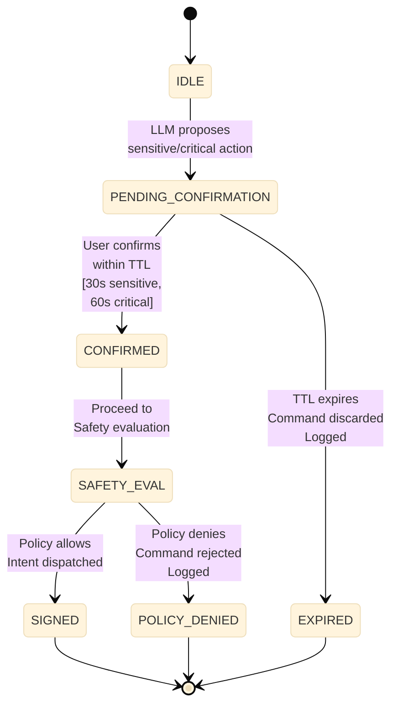

# Safety Enforcement

**Status: Specified**

Safety enforcement is the most critical component in the authority chain. It is entirely deterministic. No probabilistic system (LLM, classifier, heuristic scorer) participates in the safety enforcement path.

## Principle

The Safety Service is a **separate microservice** with its own Ed25519 signing key. It is the only component authorized to issue Safety countersignatures. Its key is not shared with the Planner, the Edge Service, or any other component.

## Safety Service Function

**Inputs:**  
A proposed HxTP intent, signed by the Planner, with full context:
- Device ID
- Action name
- Parameters
- Safety classification
- User identity
- Current time
- Device state (if relevant to policy)

**Processing:**  
OPA policy evaluation against the current policy bundle for the tenant. Policy evaluation is:
- **Synchronous** — Under 10ms per evaluation on cached bundle
- **Deterministic** — Same input always produces same output
- **Stateless** — No internal state affects decisions
- **Context-Aware** — Can reference device state, time, user roles, etc.

**Outputs:**  
- **Policy passes:** Countersigned intent (Safety signature added)
- **Policy denies:** Rejection with `ERR_POLICY_DENIED`
- **Timeout:** Fail-closed response (command not executed)

## OPA Policy Engine

**Status: Specified**

Policies are written in Rego. Policy bundles are versioned and distributed from the cloud. The local Safety proxy on the Primary Compute Node caches the current bundle.

### Policy Bundle Contents

A policy bundle includes:

1. **Per-Tenant Capability Access Rules**
   ```rego
   deny_capability_access[device_id] :-
     input.tenant_id = "premium_revoked",
     input.capability = "security_actuator"
   ```

2. **Time-Based Restrictions**
   ```rego
   deny_time_restricted[device_id] :-
     input.action = "lock_door",
     input.hour >= 2 and input.hour < 4,
     not user_override_valid
   ```

3. **Per-Device Rate Limits**
   ```rego
   deny_rate_limit :-
     input.device_id = "thermostat_living",
     count_recent_commands(5) > 10
   ```

4. **Safety-Class Enforcement Rules**
   ```rego
   require_safety_signature :-
     input.safety_class = "critical"
   ```

5. **Access Revocation Rules**
   ```rego
   deny_revoked_access :-
     input.user = "renter_id_xyz",
     lease_end_date < now
   ```

### Policy Bundle Staleness

**Status: Specified**

Cached policy bundles carry a TTL. For policies tagged `time_sensitive` (access revocation, emergency restrictions), the Safety proxy must confirm it holds a current bundle before evaluating.

**Behavior:**

| Bundle Age | Policy Type | Action |
|---|---|---|
| **Fresh** | Any | Evaluate and enforce |
| **Stale (TTL expired)** | `time_sensitive` | Fail closed (deny all) |
| **Stale** | `normal` | Serve cached bundle (fail open) |

**Time-Sensitive Policy Updates:**
- **Push mechanism** — Cloud invalidates cached bundles on local Safety proxies when critical policies change
- **Pull mechanism** — Standard pull-on-TTL-expiry mechanism (recommended TTL: 1 hour for `time_sensitive`, 4 hours for `normal`)

This ensures that access revocation (e.g., renter lease expires) takes effect within minutes even if cloud connectivity is intermittent.

## Confirmation State Machine

For actions with `safety_class ∈ {sensitive, critical}`, the execution engine enters a confirmation state before Safety evaluation:



### Confirmation Properties

**Simultaneous Pending Confirmations:**  
Multiple sensitive/critical actions can have pending confirmations at the same time. Each has an independent ID and TTL. The state machine tracks them independently.

**Expiry Behavior:**  
Expired confirmations are discarded and logged. The system does not retry automatically. The user must re-issue the intent.

**Multi-Confirmation for Sequential Actions:**  
A multi-step plan requiring multiple sensitive/critical actions does not batch confirmations. Each action requiring confirmation is confirmed independently in sequence. An agent cannot obtain blanket confirmation for a plan.

### Confirmation UI (Helix Control App)

The app displays:
- Action being proposed (in user-friendly language)
- Action parameters
- Confirmation deadline (countdown timer)
- Buttons: "Confirm" / "Reject"

The confirmation is explicit. A timeout or no response is a rejection, not an implicit confirmation.

## Safety Key Rotation

**Status: Specified (procedure defined), Implementation Pending**

Safety key rotation must propagate to all devices securely.

**Procedure:**

1. Hestia Labs generates a new Safety Service key pair
2. New public key is signed by the previous private key (chain of trust)
3. New public key + signature is distributed to all devices via OTA
4. Devices verify the signature using the old public key before accepting the new one
5. Devices update their trusted Safety public key
6. Previous key is revoked and logged in audit
7. All intents signed with the compromised key are flagged for forensic review

This prevents a compromised replacement key from being injected without proof of continuity.

## What the Safety Layer Does Not Prevent

The Safety layer enforces policy on **proposed intents**. It does not:

1. **Detect semantic errors in correct-but-wrong commands**
   - LLM proposes `turn_off` instead of `turn_on` — both are valid actions per the capability registry
   - Both pass policy (neither is dangerous)
   - One is semantically wrong (user's intent not satisfied)
   - This is a UI/UX issue, not a safety issue

2. **Prevent physical execution failures**
   - Hardware fault (relay stuck)
   - Sensor offline
   - Actuator jammed
   - These are detected at execution time, not policy evaluation time

3. **Detect LLM hallucinations that produce valid-but-unintended tool calls**
   - Example: "Set kitchen temperature" might be misinterpreted as living room
   - Valid action against valid device
   - Policy passes
   - User gets unexpected result
   - Detected via audit log review and user feedback

These failure modes are addressed by:
- **Audit logging** (forensic review)
- **Behavioral anomaly detection** ([Planned — Not Implemented](/reference/planned-features))
- **User feedback loops** (override logging, learning from corrections)

## Safety Service Integration

### From Deterministic Engine

```
Deterministic Engine sends to Safety Service:
├── intent_id (UUID)
├── device_id
├── action
├── params
├── safety_class
├── user_id
├── timestamp
├── planner_signature
└── planner_signature_over (canonical bytes)
```

### Safety Service Response

```
Safety Service returns:
├── intent_id (echoed)
├── policy_result ("PASS" | "DENY")
├── deny_reason (if DENY)
├── safety_signature (if PASS, required for critical)
└── signed_at (timestamp)
```

### Offline Safety Proxy

On the Primary Compute Node:

1. Caches policy bundle with TTL
2. Performs local OPA evaluation
3. Signs intents using locally-held Safety proxy key (distinct from cloud Safety key)
4. For offline-authorized actions only (non-critical whitelist)

See [Local vs Cloud Operation Modes](/operations/execution-modes) for complete offline section.

## OPA Rego Examples

### Example 1: Time-Based Restriction

```rego
default allow = false

allow {
  input.safety_class = "normal"
  not deny[_]
}

deny[msg] {
  input.action = "lock_door"
  current_hour >= 2
  current_hour < 4
  not input.user_confirmed_override
  msg = "Door lock restricted during sleep hours (2-4 AM)"
}

current_hour := hours.now
```

### Example 2: Per-Device Rate Limiting

```rego
default allow = false

allow {
  not deny[_]
}

deny[msg] {
  input.device_id = "thermostat_living"
  commands_in_last_5_min > 10
  msg = "Thermostat rate limit exceeded (max 10 commands per 5 minutes)"
}

commands_in_last_5_min := count(audit_log_recent_commands)
```

### Example 3: Access Revocation

```rego
default allow = false

allow {
  not deny[_]
}

deny[msg] {
  user_access := access_registry[input.user_id]
  user_access.revoked = true
  msg = sprintf("Access revoked for user %s", [input.user_id])
}

deny[msg] {
  user_access := access_registry[input.user_id]
  user_access.lease_end_date < now
  msg = sprintf("Lease expired for tenant %s", [input.user_id])
}
```

## Next Steps

- Understand [Authority Chain](/architecture/authority-chain) for how Safety fits into the complete flow
- Explore [Trust Boundaries](/security/trust-boundaries) for security properties
- See [Failure Modes](/operations/failure-modes) for how Safety unavailability is handled

## Navigation

**Breadcrumb:** Architecture → Safety Enforcement  
**Status:** Specified ✓

### Related Topics

- [Authority Chain](/architecture/authority-chain) — Complete flow including Safety Service evaluation
- [OPA Rego Language](https://www.openpolicyagent.org/docs/latest/policy-language/) — External: Policy language reference
- [Cryptographic Model](/security/cryptographic-model) — Signing keys, Safety Service key storage
- [Trust Boundaries](/security/trust-boundaries) — Safety Service as separate trust domain
- [Invariants](/security/invariants) — I-4 (Safety Service has own signing key), I-12 (failures logged before recovery)
- [Threat Model](/security/threat-model) — T-6 (Compromised Safety Service) and mitigation
- [Practical Walkthroughs](/operations/walkthroughs) — Walkthrough 4: Safety-Critical Command with Dry-Run

### Key Insight

The Safety Service is **not a library function**. It is a **separate trust domain** with:
- Its own Ed25519 signing key
- Its own process/container deployment  
- Its own policy bundles (OPA)
- Its own access control

Compromise of the Planner does **not** compromise the Safety Service.

### Understand This First

1. [Authority Chain](/architecture/authority-chain) — Learn the sequence
2. **This page** — Learn how Safety evaluation works
3. [Cryptographic Model](/security/cryptographic-model) — Understand key management
4. [Threat Model](/security/threat-model) — See why this design matters

### Next Topics

- **To see how this integrates with the full flow:** [Dispatch Pipeline](/protocol/dispatch-pipeline) (mentions Safety signature verification)
- **To understand key management:** [Cryptographic Model](/security/cryptographic-model) (Safety key storage)
- **To see attacks this defeats:** [Threat Model](/security/threat-model) (T-2, T-6)
