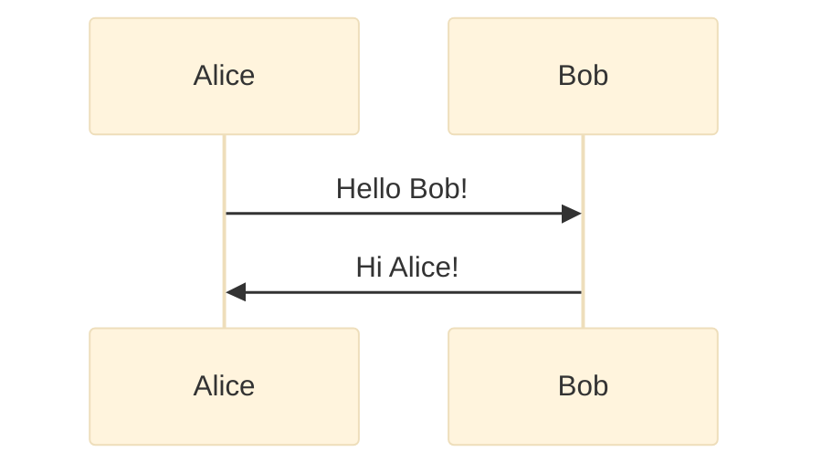

# Local Development

This documentation is a static site built with Mintlify. You can build and preview it locally during development.

## Prerequisites

- Node.js 18+ installed
- npm or yarn package manager
- Git (to clone the repository)

## Setup

### 1. Install Mintlify CLI

```bash
npm i -g mint
```

Verify installation:

```bash
mint --version
```

### 2. Clone the Repository

```bash
git clone https://github.com/hestialabs/docs.git
cd docs
```

### 3. Start Local Preview

From the project root:

```bash
mint dev
```

The documentation will be available at `http://localhost:3000` by default.

## Making Changes

### Adding New Pages

1. Create a new `.mdx` file in the appropriate directory
2. Add frontmatter with `title` and `description`
3. Write content in Markdown with MDX extensions
4. Update `docs.json` navigation to include the new page

Example:

```bash
touch security/new-page.mdx
```

Update `docs.json`:

```json
{
  "group": "Security & Trust",
  "pages": [
    "security/invariants",
    "security/new-page"
  ]
}
```

### Editing Existing Pages

Edit the `.mdx` file. Changes are hot-reloaded (page refreshes automatically).

### Using Markdown Features

- **Headings:** `# Heading 1`, `## Heading 2`, etc.
- **Code blocks:** Use backticks with language specifier
- **Tables:** Standard Markdown table syntax
- **Links:** `[text](./path/to/file)` or `[text](https://external.com)`
- **Bold/Italic:** `**bold**`, `*italic*`
- **Lists:** `- bullet` or `1. numbered`

### Adding Mermaid Diagrams

Use mermaid code blocks:



## Validating Links

Check for broken links:

```bash
mint broken-links
```

This will identify any internal or external links that are broken.

## Building for Production

To generate the static site for deployment:

```bash
mint build
```

Output is in the `.mintlify/` directory.

## Troubleshooting

### Port Already in Use

Use a different port:

```bash
mint dev --port 3333
```

### Changes Not Showing

1. Ensure all `.mdx` files have valid frontmatter (title, description)
2. Check that `docs.json` is valid JSON
3. Restart the dev server: `Ctrl+C`, then `mint dev`

### Clear Cache Issues

```bash
rm -rf ~/.mintlify
mint dev
```

### "Sharp" Module Error

If you see "Could not load the 'sharp' module":

1. Remove the CLI: `npm remove -g mint`
2. Upgrade to Node v19 or higher
3. Reinstall the CLI: `npm i -g mint`

## Project Structure

```
docs/
├── docs.json              # Navigation and configuration
├── index.mdx              # Homepage
├── architecture/          # System design documentation
├── protocol/              # Protocol specifications
├── operations/            # Operations and deployment guides
├── security/              # Security model and threat analysis
├── reference/             # API reference, FAQ, technical lookup
└── images/                # Diagrams and embedded images
```

## Style Guidelines

This documentation follows Hestia Labs standards:

- **Active voice:** "The system validates..." not "Validation is performed..."
- **Second person:** "You can configure..." not "One can configure..."
- **Direct tone:** No marketing language, no buzzwords
- **Technical precision:** Define terms on first use, maintain consistent terminology
- **Minimal decoration:** No emojis, no line art, no unnecessary formatting

See [AGENTS.md](./AGENTS.md) for the complete style guide.

## Contributing

1. Fork the repository
2. Create a feature branch: `git checkout -b docs/add-new-section`
3. Make your changes
4. Test locally: `mint dev`
5. Check links: `mint broken-links`
6. Commit: `git commit -m "docs: add new section on X"`
7. Push and open a Pull Request

## IDE Setup

For **VS Code**:

- Install the [MDX VSCode extension](https://marketplace.visualstudio.com/items?itemName=unifiedjs.vscode-mdx) for syntax highlighting
- Install [Prettier](https://marketplace.visualstudio.com/items?itemName=esbenp.prettier-vscode) for automatic formatting

Configure Prettier to format on save for cleaner diffs.

## Questions?

- Review existing `.mdx` files for examples
- Check the [docs.json](./docs.json) structure for navigation patterns
- Refer to [Markdown Essentials](./essentials/markdown.mdx) for formatting reference
