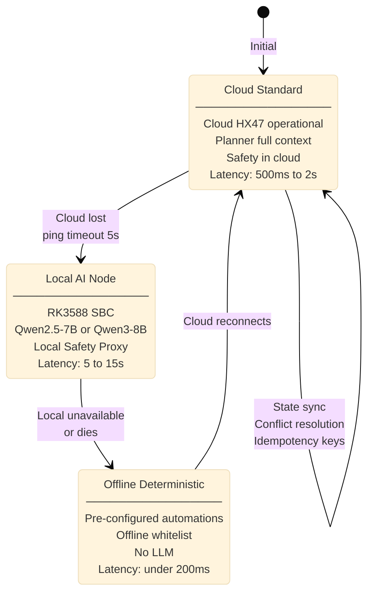

# Execution Modes

**Status: Specified**

The Hestia Labs system operates across three tiers, with automatic fallback based on cloud connectivity. Each tier provides a baseline level of capability with graceful degradation.

## Mode Comparison Matrix

| Capability | Cloud Standard | Local AI Node | Offline Deterministic |
|---|---|---|---|
| **LLM Reasoning** | Full (Qwen3-32B) | Limited (7-8B @ Q4_K_M) | None |
| **Memory Depth** | Full history (Postgres) | Local cache (24-72h) | None |
| **Multi-Agent Orchestration** | Yes (Specialists) | Yes (constrained) | No |
| **Digital Execution** | Yes (API, Browser, Shell) | No (physical only) | No |
| **Response Latency** | 500ms–2s (LLM) | 5–15s (local inference) | Under 200ms |
| **Internet Dependency** | Required | Not required | Not required |
| **Safety Enforcement** | Cloud Safety Service | Local Safety Proxy | Local Safety Proxy (restricted) |
| **OTA Updates** | Real-time push | Pull on reconnect | Pull on reconnect |
| **Audit Log** | Cloud + local | Local + sync on reconnect | Local (sync pending) |
| **Automation Execution** | Full (all types) | Basic trigger-action | Basic trigger-action |
| **User Confirmation Gates** | Yes (memory-informed) | Yes (recent context only) | Yes (stored overrides) |

## Tier Transition

Tier transitions are **automatic** based on cloud connectivity state. Users do not select tiers.



### Transition Triggers

| Trigger | Source | Latency |
|---|---|---|

## Navigation

**Breadcrumb:** Operations → Execution Modes  
**Status:** Specified ✓

### Related Topics

- [Architecture Overview](/architecture/overview) — System principles and component status
- [Authority Chain](/architecture/authority-chain) — How commands flow across all three modes
- [Safety Enforcement](/architecture/safety-enforcement) — Policy caching for offline mode
- [Failure Modes](/operations/failure-modes) — Tier transition failures and recovery
- [Practical Walkthroughs](/operations/walkthroughs) — Multi-tier orchestration examples

### Understand Tier Transitions

**Automatic:** Users do not select modes. System automatically transitions based on cloud connectivity.

- Cloud available → Cloud Standard (full features, cloud HX47, cloud Safety)
- Cloud unavailable → Local AI Node (if present; local HX47, local Safety Proxy)
- All unavailable → Offline Deterministic (no LLM; automations only)
- Cloud reconnects → State sync back to Cloud Standard

### Key Insight

Each tier has **different** authority and capability models:

| Aspect | Cloud | Local | Offline |
|---|---|---|---|
| **LLM** | Cloud HX47 | Local (Qwen) | Pre-configured only |
| **Authority** | Cloud Safety Service | Local Safety Proxy (cached policy) | Cached safe-whitelist |
| **Latency** | 500ms to 2s | 5 to 15s | under 200ms |
| **Connectivity** | Requires cloud | LAN only | Local only |

### Next Topics

- **How commands are validated in each tier:** [Dispatch Pipeline](/protocol/dispatch-pipeline)
- **What happens when tier transition fails:** [Failure Modes](/operations/failure-modes)
- **Real multi-tier example:** [Practical Walkthroughs](/operations/walkthroughs) (Walkthrough 5)
|---|---|---|
| Cloud connect lost | HxTP Edge Service → Cloud ping timeout (5s) | Immediate |
| Local AI Node unavailable | Edge Service → LAN discovery fails | Immediate |
| Cloud connect restored | HxTP Edge Service → Cloud ping succeeds | ~5s detection |

## Cloud Standard Mode

**When Available:** Cloud connectivity present, HxTP Edge Service online, Hestia Cloud reachable

### Architecture

```
User Intent (voice / app)
     ↓
Helix Control App OR HK-47
     ↓
HxTP Edge Service (local)
     ↓
Hestia Cloud (remote)
     ├─ HX47 Planner (Qwen3-32B)
     ├─ Safety Service (OPA)
     └─ Audit Log Service
     ↓
Edge Service (forward signed intent)
     ↓
Helix Nodes / Digital Agents
     ↓
Result → Cloud Audit Log → Local Redis Cache
```

### Capabilities

- **Full LLM reasoning** — 32B parameter model, no constraint
- **Full memory access** — Complete behavioral history, all stored patterns, full semantic memory
- **Multi-agent orchestration** — Planner spawns Specialist agents for complex tasks
- **Digital execution** — HX100 agents access filesystem, processes, APIs, browsers
- **Real-time OTA** — Firmware updates pushed immediately
- **Remote access** — Authorized users access home from outside network

### Safety Enforcement

**Planner:** Cloud HX47 (Qwen3-32B)  
**Safety Service:** Cloud OPA with real-time policy bundles  
**Safety Signature Required:** Yes (for sensitive/critical actions)  
**Policy Updates:** Real-time push from cloud

### Latency Budget

- LLM inference: 500ms–2s
- Safety evaluation: under 10ms
- Dispatch to device: 50–200ms (LAN)
- Device execution: 10–500ms (action-dependent)
- **Total latency p99:** 1–3 seconds for typical commands

### Failure Modes

See [Failure Modes: Cloud Connectivity Loss](/operations/failure-modes#cloud-connectivity-loss-complete-outage) for recovery strategy.

---

## Local AI Node Mode

**When Available:** Cloud unavailable, Local AI Node (RK3588 SBC) operational and on LAN

**Hardware:** RK3588 SBC, 8GB RAM, 64GB SSD, RKNN accelerator or llama.cpp

### Architecture

```
User Intent (voice)
     ↓
HK-47 → Local STT (Whisper)
     ↓
HxTP Edge Service (local)
     ↓
Local HX47 (RK3588)
├─ Whisper STT
├─ Qwen2.5-7B OR Qwen3-8B @ Q4_K_M
├─ Local Planner (same logic as cloud)
├─ Local memory cache (24-72h window)
└─ Piper TTS
     ↓
Local Safety Proxy
├─ OPA engine
├─ Cached policy bundle (TTL: 1-4h)
└─ Local signing authority
     ↓
Signed Intent → Edge Service
     ↓
Helix Nodes / HX100 Agents (local only)
     ↓
Result → Local Redis Cache (pending cloud sync)
```

### Capabilities

- **Limited LLM reasoning** — 7-8B model, lower capacity than cloud
- **Constrained memory** — Local behavioral cache (24-72h window)
- **Basic multi-agent orchestration** — Specialists spawned but more conservative (smaller token budgets)
- **Physical execution only** — No digital domain (no filesystem, APIs, etc.)
- **OTA pull-based** — Checks for updates on cloud reconnect
- **Local-only access** — Remote access unavailable (cloud is unreachable)

### Safety Enforcement

**Planner:** Local HX47 (7-8B Qwen)  
**Safety Service:** Local Safety Proxy (same authority as Planner currently)  
**Safety Signature Required:** Yes (but signed by local proxy, not cloud)  
**Policy Updates:** Cached (refresh on cloud reconnect)

**Important:** The local Safety Proxy uses a **different signing key** than the cloud Safety Service. Both are Ed25519 keys, but the device must be configured to accept both authorities (tenant-scoped).

### Latency Budget

- LLM inference: 5–15 seconds (on RK3588 with RKNN)
- LLM inference: 15–40 seconds (on RPi5 with llama.cpp)
- Safety evaluation: under 10ms (same as cloud)
- Dispatch to device: 50–200ms (LAN)
- Device execution: 10–500ms (action-dependent)
- **Total latency p99:** 8–50 seconds (dominated by LLM)

**UX Consideration:** Helix Control App must display "Processing..." indicator with realistic timing. A 15-second wait without feedback feels broken.

### Memory Architecture

Local memory is **not** the full personal knowledge store. It is a sliding window of recent context:

- **Behavioral patterns** — Last 72 hours of automations triggered
- **Override history** — Recent deviations from learned behavior
- **Device state** — Last confirmed state of all devices
- **Ambient context** — Time of day, occupancy, recent activities

Deep learning from months of history is not performed locally. That happens during reflection engine runs on cloud (if connected).

### Failure Modes

See [Local AI Node Unavailability](/operations/failure-modes#local-ai-node-dies-or-unavailable) for recovery.

---

## Offline Deterministic Mode

**When Available:** Cloud AND Local AI Node both unavailable

### Architecture

```
User Intent (manual control OR preconfig automation)
     ↓
Helix Control App (manual) OR Trigger Detector
     ↓
Offline Rule Engine (deterministic)
├─ Preconfig automations (light on at sunset)
├─ Time-based triggers (7am weekday alarm)
├─ Sensor-based triggers (motion sensor)
└─ Learned automations (from broken chain analysis)
     ↓
Local Safety Proxy
├─ Offline-authorized capability whitelist
├─ No LLM-dependent actions allowed
└─ Cached policy bundle (TTL-based)
     ↓
Signed Intent (by Safety Proxy)
     ↓
Edge Service
     ↓
Helix Nodes (physical only)
     ↓
Result → Local Cache (pending cloud sync)
```

### Capabilities

- **No LLM reasoning** — Only preconfig automations, no novel requests
- **No memory learning** — Rules are static
- **No digital execution** — Physical devices only (lights, thermostats, basic actuators)
- **Deterministic execution** — No probabilistic decisions
- **Offline-authorized actions only** — Critical actions (locks, alarms, deploys) prohibited
- **Cached policy enforcement** — Same policy bundle as local AI node (if still fresh)

### Supported Actions (Offline-Authorized Whitelist)

Devices CAN execute offline:
- ✓ Light control (on/off/brightness)
- ✓ Thermostat (set temperature within learned bounds)
- ✓ Simple sensors (read temperature, humidity)
- ✓ Preconfig automations (motion-triggered lights)
- ✓ Time-triggered automations (bedtime, morning alarm)

Devices CANNOT execute offline:
- ✗ Door locks (security-critical)
- ✗ Alarms (security-critical)
- ✗ Deployments or remote commands (critical)
- ✗ Credential operations
- ✗ API calls to external services
- ✗ Any LLM-proposed action

### Learned Automations in Offline Mode

**Status: Specified — implementation details pending**

Automations that can run offline are those with:
- Deterministic logic (no probabilistic decisions)
- Known device state (no external API calls)
- Action safety_class ≤ sensitive (no critical actions)
- Preconfig in the system (not dynamically added by LLM)

Examples:
- "Turn on hallway lights when motion detected (7am-11pm only)"
- "Adjust temperature 2° when occupancy leaves"
- "Bedtime automation: Lock accessible lights, set temp to 68°F"

These are learned during online operation and installed as deterministic rules.

### Safety Enforcement

**Authority:** Local Safety Proxy (offline signing key)  
**Policy:** Offline-authorized whitelist only  
**Policy Freshness:** Bundle TTL enforced (fail closed if stale for `time_sensitive`)  
**Manual overrides:** User can confirm offline sensitive actions via app (no internet required)

### Latency Budget

- Rule evaluation: 10–50ms
- Dispatch to device: 50–200ms (LAN)
- Device execution: 10–500ms
- **Total latency p99:** under 500ms

### Data Loss Risk

Offline commands are logged locally to the Edge Service's Postgres instance. When cloud connectivity is restored:

- Local event log is uploaded to cloud
- Cloud applies events with idempotency keys (no duplicates)
- Conflicts resolved by last-write-wins per device state field
- User notified of any significant divergences

**Example Divergence:**
- Offline: User manually turned lights on (09:00)
- Cloud: Automation turned lights off (08:50)
- Resolution: User's manual action wins (last-write), lights stay on
- User notified: "Your manual control overrode stored automation"

### Failure Modes

See [Cloud Connectivity Loss](/operations/failure-modes#cloud-connectivity-loss-complete-outage) for recovery details.

---

## State Synchronization on Cloud Reconnection

**Status: Specified — implementation pending**

When cloud connectivity is restored after offline/local-only operation:

### Sync Sequence

```
1. Edge Service → Cloud: "Establishing sync"
   ├─ Device: reconnection handshake
   └─ Telemetry: signal strength, uptime, error count

2. Edge Service → Cloud: Upload local audit log
   ├─ Entries since last cloud sync
   ├─ Complete with timestamps and command results
   └─ Idempotency keys for dedup

3. Cloud → Edge Service: Download policy bundle updates
   ├─ New bundle version (if changed)
   ├─ New Safety key (if rotated)
   ├─ New OTA packages (if available)
   └─ Signature verification on all

4. Cloud → Edge Service: Conflict resolution
   ├─ Compare cloud state vs local state
   ├─ For each device: last-write-wins per field
   ├─ Log all conflicts with resolution logic
   └─ Return unified state

5. User Notified: "Home synchronized. +3 commands applied."
   └─ If divergences: "Manual override for living_room_light logged"
```

### Idempotency

Each command carries an idempotency key (UUID):

```json
{
  "intent_id": "550e8400-e29b-41d4-a716-446655440000",
  "idempotency_key": "user-cmd-20260227-14350001",
  ...
}
```

When syncing:
- Same idempotency key seen twice → Skip (already applied)
- New key → Apply to cloud state
- This prevents "turn on light" from being applied twice if sync is interrupted

### Last-Write-Wins Strategy

Per device, per state field:

```
Device: living_room_light
Field: state (on/off)

Cloud state:
  value: "off"
  timestamp: "2026-02-27T11:00:00Z"
  source: "automation"

Local state (offline):
  value: "on"
  timestamp: "2026-02-27T13:30:00Z"
  source: "user_manual"

Resolution:
  Winner: local (later timestamp)
  New value: "on"
  Comment: "User manual override during offline period"
  Logged: yes
```

### Behavioral Consistency Across Tiers

**Critical invariant:** Automation execution must be identical across all tiers.

- An automation that runs at sunset in Cloud Standard mode must run at sunset in Offline Deterministic mode
- A time-based rule must execute consistently
- State transitions must be atomic (no race conditions during tier switch)

**Conflict Resolution Examples:**

| Scenario | Cloud State | Local State | Resolution |
|---|---|---|---|
| User manual override offline | Automation turned off (11:00) | User turned on (13:30) | Local wins (manual is intentional) |
| Automation in Local, not Cloud | N/A | Automation fired (13:00) | Cloud accepts new state |
| Device offline state unknown | Temperature 72°F (sync age: 2h) | Temperature unknown (offline) | Cloud state used (most recent certain) |

---

## User Experience by Mode

### Cloud Standard
- Voice commands work instantly (sub-2s response)
- Full conversational ability
- Complex multi-step automations
- Remote access from outside network
- Always-on experience

### Local AI Node
- Voice commands work but slower (5-15s)
- Limited conversation (recent context only)
- Basic automations available
- Processing indicator visible ("Thinking...")
- "Still here if cloud goes down" safety net

### Offline Deterministic
- Voice commands limited (preconfig only)
- App shows "Using offline automations"
- Manual control always available
- No hesitation (commands work instantly)
- "Essential operations only" mindset

---

## Recommended Deployment Strategy

### Single Home (v1-v2)
- Cloud Standard only (no Local AI Node)
- Offline Deterministic available if cloud outage
- Adequate for residential use

### Multi-Home (v2+)
- Local AI Node in Primary Compute Node
- Provides sovereignty for power-users
- Reduces cloud dependency
- Better resilience SLA

### Enterprise Deployments (v3+)
- Distributed cloud HX47
- Dedicated Local AI Nodes per property
- Offline Deterministic with full automation
- Under 1 second latency target

---

## Next Steps

- See [Failure Modes](/operations/failure-modes#cloud-connectivity-loss-complete-outage) for how transitions are managed
- Explore [State Synchronization](/operations/execution-modes#state-synchronization-on-cloud-reconnection) in detail
- Review [Local Safety Proxy](/architecture/safety-enforcement#offline-safety-proxy) configuration
