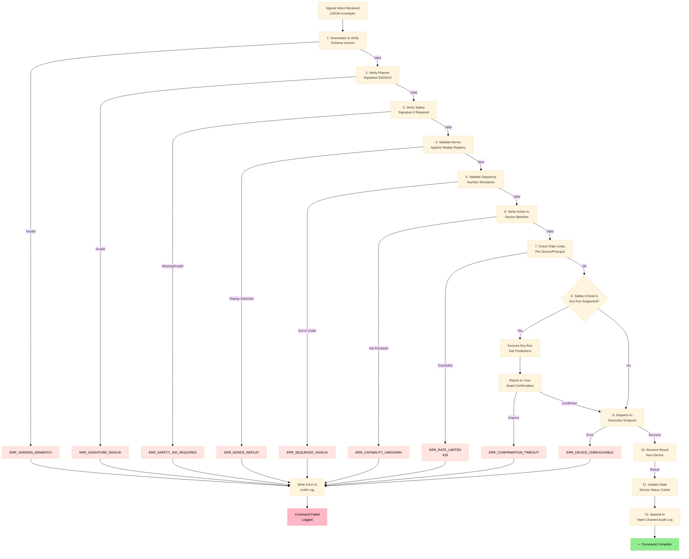

# Dispatch Pipeline

**Status: Specified**

The Dispatch Pipeline is the path from a validated, signed intent to physical or digital execution. It implements the complete validation and enforcement sequence at the Edge Service.

## Pipeline Visualization



## Stage Details

### 1. Envelope Deserialization + Version Check

**Input:** Raw bytes from network transport  
**Processing:**
- Deserialize bytes to envelope structure (JSON or binary)
- Extract `schema_version` field
- Check if version is in supported range

**Decision:**
- Version supported → Continue to next stage
- Version unsupported → `ERR_VERSION_MISMATCH`

**Error Response:**
```json
{
  "intent_id": "<intent_id>",
  "status": "ERR_VERSION_MISMATCH",
  "message": "Envelope version 42 not supported. Supported: 1-2",
  "logged": true
}
```

**Log Entry:**
```
event_type: "version_mismatch"
intent_id: "<intent_id>"
device_id: "<target_id>"
error: "ERR_VERSION_MISMATCH"
timestamp: "<ISO8601>"
```

---

### 2. Planner Signature Verification

**Input:** Deserialized envelope with `planner_signature` field  
**Processing:**
- Canonicalize all envelope fields except signatures
- Retrieve Planner public key by `issuer_id`
- Verify signature using Ed25519

**Decision:**
- Signature valid → Continue
- Signature invalid → `ERR_SIGNATURE_INVALID`

**Error Response:**
```json
{
  "intent_id": "<intent_id>",
  "status": "ERR_SIGNATURE_INVALID",
  "message": "Planner signature verification failed",
  "logged": true
}
```

**Log Entry:**
```
event_type: "signature_verification_failed"
intent_id: "<intent_id>"
device_id: "<target_id>"
signature_type: "planner"
issuer_id: "<issuer_id>"
error: "ERR_SIGNATURE_INVALID"
timestamp: "<ISO8601>"
```

---

### 3. Safety Signature Verification

**Input:** Envelope and intent safety class  
**Processing:**
- Extract safety_class from intent (via capability registry)
- If safety_class ∈ {sensitive, critical}:
  - Check if `safety_signature` field is present and non-null
  - Retrieve Safety Service public key
  - Verify signature over same canonical bytes as Planner signed

**Decision:**
- Signature required and valid → Continue
- Signature required but invalid → `ERR_SIGNATURE_INVALID`
- Signature required but absent → `ERR_SAFETY_SIGNATURE_REQUIRED`
- Signature not required (normal safe_class) → Continue

**Error Response (Missing):**
```json
{
  "intent_id": "<intent_id>",
  "status": "ERR_SAFETY_SIGNATURE_REQUIRED",
  "message": "Action 'lock_door' (critical) requires Safety countersignature",
  "logged": true
}
```

**Log Entry:**
```
event_type: "safety_signature_missing"
intent_id: "<intent_id>"
device_id: "<target_id>"
safety_class: "critical"
action: "lock_door"
error: "ERR_SAFETY_SIGNATURE_REQUIRED"
timestamp: "<ISO8601>"
```

---

### 4. Nonce Validation

**Input:** Nonce from envelope, device ID  
**Processing:**
- Look up nonce registry entry for device
- Check if nonce is current (matches last registered session nonce)
- Check if nonce has been used before (in used-nonce history)

**Decision:**
- Nonce current and unused → Mark as used, continue
- Nonce replayed (used before) → `ERR_NONCE_REPLAY`
- Nonce stale (old session) → `ERR_NONCE_INVALID` (variant of ERR_SEQUENCE_INVALID)

**Error Response:**
```json
{
  "intent_id": "<intent_id>",
  "status": "ERR_NONCE_REPLAY",
  "message": "Nonce has been used before (potential attack)",
  "logged": true,
  "alert": true
}
```

**Log Entry (SECURITY EVENT):**
```
event_type: "nonce_replay_detected"
intent_id: "<intent_id>"
device_id: "<target_id>"
nonce: "<first_8_chars>"
previous_use_timestamp: "<ISO8601>"
error: "ERR_NONCE_REPLAY"
timestamp: "<ISO8601>"
severity: "SECURITY_ALERT"
```

---

### 5. Sequence Number Validation

**Input:** Sequence from envelope, device session state  
**Processing:**
- Retrieve last sequence number from device session
- Check if incoming sequence equals last_sequence + 1
- If out of order, check if in acceptable skew window (e.g., ±5)

**Decision:**
- Sequence in order → Update last_sequence, continue
- Sequence far out of order → `ERR_SEQUENCE_INVALID`
- Sequence duplicate → `ERR_NONCE_REPLAY` (caught earlier, but double-check)

**Error Response:**
```json
{
  "intent_id": "<intent_id>",
  "status": "ERR_SEQUENCE_INVALID",
  "message": "Sequence 42 out of expected range [106-111]",
  "logged": true
}
```

**Log Entry:**
```
event_type: "sequence_invalid"
intent_id: "<intent_id>"
device_id: "<target_id>"
received_sequence: 42
expected_range: "106-111"
error: "ERR_SEQUENCE_INVALID"
timestamp: "<ISO8601>"
```

---

### 6. Capability Whitelist Check

**Input:** Device ID, capability, action from envelope  
**Processing:**
- Query capability registry for device_id
- Check if capability is in device's registered set
- Check if action is in capability's action enum
- Verify intent target_id matches requested device

**Decision:**
- Capability and action found → Continue
- Capability not found → `ERR_CAPABILITY_UNKNOWN`
- Action not found → `ERR_ACTION_UNKNOWN`

**Error Response:**
```json
{
  "intent_id": "<intent_id>",
  "status": "ERR_ACTION_UNKNOWN",
  "message": "Action 'turn_on' not in capability 'sensor_read' for device 'temperature_sensor_01'",
  "logged": true
}
```

**Log Entry:**
```
event_type: "action_unknown"
intent_id: "<intent_id>"
device_id: "<target_id>"
capability: "sensor_read"
action: "turn_on"
available_actions: ["read_temperature", "calibrate"]
error: "ERR_ACTION_UNKNOWN"
timestamp: "<ISO8601>"
```

---

### 7. Rate Limit Check

**Input:** Device ID, action, capability  
**Processing:**
- Query rate limit buckets in Redis for:
  - Device-wide limit (default: 60 cmds/min)
  - Action-specific limit (from policy bundle)
  - Safety-class specific limit (critical: 5/hour)
- Increment bucket counters atomically
- Check if bucket exceeded

**Decision:**
- Within limits → Continue
- Limit exceeded → `ERR_RATE_LIMITED`

**Error Response:**
```json
{
  "intent_id": "<intent_id>",
  "status": "ERR_RATE_LIMITED",
  "message": "Device 'thermostat_01' exceeded rate limit (10 commands per 5 minutes)",
  "retry_after_seconds": 15,
  "logged": true
}
```

**Log Entry:**
```
event_type: "rate_limit_exceeded"
intent_id: "<intent_id>"
device_id: "<target_id>"
action: "set_temperature"
limit_bucket: "device_wide"
limit_config: "60_per_minute"
current_count: 61
error: "ERR_RATE_LIMITED"
timestamp: "<ISO8601>"
```

---

### 8. Dry-Run Phase

**Input:** Intent with safety_class = critical, tool manifest with supports_dry_run = true  
**Processing:**
- Dispatch intent to device with `dry_run: true` parameter
- Device computes projected changes without applying them
- Device returns structured diff or change summary
- Edge Service collects result

**Decision:**
- Dry-run succeeds → Await user confirmation
- Dry-run fails → Report failure to user, `ERR_EXECUTION_FAILED` (dry-run phase)

**Dry-Run Response:**
```json
{
  "intent_id": "<intent_id>",
  "phase": "dry_run",
  "status": "DRY_RUN_SUCCESS",
  "projected_changes": {
    "service_state": "deployed",
    "pods_affected": 3,
    "estimated_downtime_ms": 500
  }
}
```

**User Confirmation:**
The Helix Control App displays the dry-run result and awaits user confirmation:
- User confirms → Send new intent with dry_run: false
- User rejects → Discard, log rejection
- Timeout → Discard, log timeout

**Log Entry:**
```
event_type: "dry_run_completed"
intent_id: "<intent_id>"
device_id: "<target_id>"
action: "deploy_service"
dry_run_result: "success"
user_confirmation: "pending"
confirmation_deadline: "<ISO8601>"
timestamp: "<ISO8601>"
```

---

### 9. Dispatch to Execution Endpoint

**Input:** Validated intent  
**Processing:**
- Establish connection to target device (or route via MQTT if offline)
- Send complete signed intent
- Await response with timeout (default: 30 seconds)

**Decision:**
- Device responsive → Await execution result
- Device timeout → `ERR_EXECUTION_TIMEOUT`
- Device unreachable → `ERR_DEVICE_UNREACHABLE` (device status update, not execution failure)

**Connection Strategies:**
- **Direct TCP (LAN):** Device is on same network as Edge Service, direct connection established
- **MQTT queue:** Device is offline or in another subnet, intent enqueued to MQTT broker
- **Cloud relay:** Device is remote, intent sent via cloud router

**Log Entry:**
```
event_type: "dispatch_started"
intent_id: "<intent_id>"
device_id: "<target_id>"
dispatch_method: "direct_tcp"
timestamp: "<ISO8601>"
```

---

### 10. Execution Result Received

**Input:** Response from execution endpoint  
**Processing:**
- Receive response structure:
  ```json
  {
    "intent_id": "<intent_id>",
    "status": "SUCCESS | ERR_EXECUTION_FAILED | ERR_EXECUTION_TIMEOUT",
    "result": { ... } | null,
    "error_code": integer | null
  }
  ```
- Validate response schema
- Extract result or error

**Decision:**
- Success → Continue to state update
- Execution failure → Log failure, continue to state update
- Timeout → Log timeout, continue to state update

**Result Examples:**

Success response:
```json
{
  "intent_id": "<intent_id>",
  "status": "SUCCESS",
  "result": {
    "state": "on",
    "power_Draw_mw": 1240,
    "timestamp": "2026-02-27T14:35:07Z"
  }
}
```

Failure response:
```json
{
  "intent_id": "<intent_id>",
  "status": "ERR_EXECUTION_FAILED",
  "error_code": 42,
  "error_message": "Relay stuck - hardware fault detected"
}
```

---

### 11. State Update

**Input:** Execution result  
**Processing:**
- Update device state in Redis cache
- Publish state change to MQTT topic (subscribers: Helix Control App, automations)
- Mark intent as executed in session state

**Important:** State is **only** updated on success. Failed commands do not update device state. This prevents the system from reflecting a state that wasn't actually achieved.

**State Update for Success:**
```
Redis:
  device:<device_id>:state = {
    "action": "turn_on",
    "result": {...},
    "timestamp": "<ISO8601>",
    "intent_id": "<intent_id>"
  }

MQTT Publish:
  Topic: device/<device_id>/state
  Payload: {
    "state": "on",
    "power_mw": 1240,
    "updated_at": "<ISO8601>"
  }
```

**Log Entry:**
```
event_type: "state_update"
intent_id: "<intent_id>"
device_id: "<target_id>"
previous_state: {...}
new_state: {...}
timestamp: "<ISO8601>"
```

---

### 12. Audit Log Entry Written

**Input:** Complete execution journey (intent, validations, result)  
**Processing:**
- Construct audit log entry with all context
- Compute hash of entry + previous hash
- Append to Postgres audit log table atomically
- Distribute to audit log subscribers

**Audit Log Entry Structure:**
```json
{
  "row_id": 987654,
  "row_hash": "<SHA256>",
  "prev_hash": "<SHA256 of previous row>",
  "event_type": "command_executed",
  "intent_id": "<intent_id>",
  "device_id": "<target_id>",
  "action": "turn_on",
  "issuer_id": "planner-key-prod-001",
  "timestamp": "2026-02-27T14:35:08Z",
  "result": "SUCCESS",
  "user_id": "<tenant_id>",
  "validation_gates": {
    "version_check": "PASS",
    "planner_signature": "PASS",
    "safety_signature": "PASS (required)",
    "nonce_validation": "PASS",
    "sequence_validation": "PASS",
    "capability_whitelist": "PASS",
    "rate_limit": "PASS"
  }
}
```

The hash chain provides tamper evidence. Any modification to the audit log breaks the chain at that row and all subsequent rows.

**Log Subscribers:**
- Security dashboard (real-time anomaly detection)
- Audit compliance system (retention and reporting)
- Fleet analytics (command patterns, failure rates)

---

## Pipeline Invariants

1. **No step may be bypassed.** All 12 stages execute in sequence. There is no "fast path" that skips validation.

2. **The pipeline is not configurable at runtime.** Stage order, validation rules, and error handling cannot be modified by application code or plugins.

3. **All rejections are logged.** Every `ERR_*` response produces an audit log entry with full context.

4. **State is only updated on success.** Failed commands do not update device state. If execution fails, the world is left unchanged.

5. **Nonce is consumed atomically.** Once a nonce is validated, it is marked as used. A second request with the same nonce is rejected as replay, even if it arrives before the first one completes.

## Next Steps

- See [HxTP Protocol](/protocol/hxtp-protocol) for envelope structure and schema
- Explore [Authority Chain](/architecture/authority-chain) for intent creation and signing
- Learn [Cryptographic Model](/security/cryptographic-model) for signature verification details

## Navigation

**Breadcrumb:** Protocol → Dispatch Pipeline  
**Status:** Specified ✓

### Related Topics

- [HxTP Protocol](/protocol/hxtp-protocol) — Message format and wire structure
- [Authority Chain](/architecture/authority-chain) — Intent creation and signing (before pipeline)
- [Safety Enforcement](/architecture/safety-enforcement) — Policy evaluation (Stage 8 output)
- [Capability Manifest](/architecture/capability-manifest) — Whitelist check (Stage 6)
- [Cryptographic Model](/security/cryptographic-model) — Signature verification details
- [Quick Reference](/reference/quick-reference) — Error codes and their meanings
- [Practical Walkthroughs](/operations/walkthroughs) — Real dispatch examples

### The 12-Stage Gauntlet

This pipeline is the **enforcement point**. Every command must pass all 12 stages or execution is denied.

| Stage | What It Does |
|---|---|
| 1-3 | Envelope validity | 
| 4-7 | Cryptographic and capability validation |
| 8 | Dry-run prediction (if critical) |
| 9-10 | Dispatch and execution |
| 11-12 | Logging and state update |

### Reading This Document

1. Start with [Pipeline Visualization](#pipeline-visualization) diagram
2. Read [Stage Details](#stage-details) for your domain:
   - **Embedded engineers:** Focus on stages 1-3 (signature verification)
   - **Edge Service builders:** Focus on stages 1-7 (validation)
   - **Security auditors:** Understand all 12 stages
3. Cross-reference [Dispatch Pipeline Errors](#dispatch-pipe-errors) for error handling

### Next Topics

- **How intents are created:** [Authority Chain](/architecture/authority-chain)
- **What encryption/signing is used:** [Cryptographic Model](/security/cryptographic-model)
- **Real example walkthrough:** [Practical Walkthroughs](/operations/walkthroughs) (Walkthrough 3 & 4)
