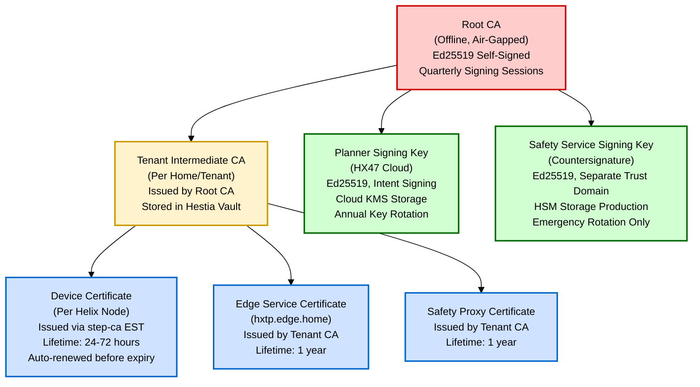

# Cryptographic Model

**Status: Specified**

All cryptographic decisions are standards-based and proven. No custom cryptography.

## Algorithms

| Purpose | Algorithm | Details |
|---|---|---|
| **Message Signing** | Ed25519 | RFC 8032. EDNSA with SHA-512. 64-byte signatures. |
| **Transport Encryption** | TLS 1.3 | RFC 8446. Mutual authentication (mTLS) required. |
| **Payload Encryption** | AES-256-GCM | NIST FIPS 197. 256-bit keys. Authenticated encryption. Mandatory for critical-class actuators. |
| **Certificate Hashing** | SHA-256 | NIST FIPS 180-4. Deterministic, collision-resistant. |
| **Audit Log Hash Chain** | SHA-256 | Same as certificates (consistency). |
| **Key Derivation** | Not Applicable | Ed25519 keys are generated fresh per identity. No HKDF or KDF used for key derivation. |

## Key Hierarchy



## Certificate Lifecycle

### Device Certificate (ESP32-S3)

**Lifetime:** 24–72 hours (configured per deployment)  
**Issuer:** Tenant Intermediate CA (via step-ca RA)  
**Renewal:** Automated via EST protocol (RFC 7030)

**Timeline:**
1. Device boots with previous certificate
2. At 50% lifetime, renewal window opens
3. Device initiates EST renewal request to step-ca RA
4. RA issues new certificate (same subject, new serial)
5. Device installs new certificate
6. Old certificate becomes backup, then discarded after 1 hour

**Renewal Failure Handling:**
- 1st failure: Retry in 1 second
- 2nd-3rd failure: Retry in 2, 4 seconds
- 4th-5th failure: Retry in 8, 30 seconds
- 6th-7th failure: Retry in 30 minutes (exponential backoff)
- After >24 hours: Device flagged as unable to authorize

**Expiry:**
- Device with expired certificate CANNOT authenticate via mTLS
- Device cannot receive HxTP commands
- MQTT telemetry client may work (lossy channel, not authenticated)
- Manual re-provisioning required if renewal fails completely

**Revocation:**
- CRL (Certificate Revocation List) distributed to Edge Service
- Edge Service caches CRL (max staleness: 4 hours)
- Devices in offline mode use cached CRL from last sync
- OCSP not used (unreliable for intermittent connectivity)

### Edge Service Certificate

**Lifetime:** 1 year  
**Subject:** `CN=hxtp-edge-home.local` (or DNS name of Edge Service)  
**Renewal:** Automatic, renewed at 90% of lifetime  
**Purpose:** Server certificate for device←→Edge Service mTLS

### Tenant CA Certificate

**Lifetime:** 3–5 years  
**Issued by:** Root CA (offline signing)  
**Storage:** Hestia-operated vault (encrypted at rest)  
**Used for:** Issuing all tenant-specific device and service certificates

### Root CA Certificate

**Lifetime:** 10 years  
**Storage:** Offline, air-gapped, HSM or vault  
**Access:** Quarterly batch signing session only  
**Backup:** Multiple geographic locations, encrypted  
**Compromise Response:** Emergency key rotation (see below)

## Key Storage

### Helix Nodes (ESP32-S3)

**Private Key Storage:**
- Encrypted flash (ESP-IDF flash encryption)
- 128-bit AES-256-GCM key derived from device ID
- Flash encryption enforced at provisioning time

**Standard Tier (current v1):**
- No dedicated secure element
- Flash encryption only
- Physical tamper: Key extraction possible with sophisticated attacks

**High-Security Actuator Tier (Planned — Not Implemented):**
- ATECC608B or STSAFE-A secure element
- Private key never leaves secure element
- Signing operations in-element (device sends payload, secure element returns signature)
- Hardware-bound (keys cannot be extracted even with full device disassembly)

### AI Node / Cloud Services

**Private Key Storage:**
- Environment-secured secret store (HashiCorp Vault, AWS Secrets Manager, etc.)
- Encrypted at rest (AES-256)
- Encrypted in transit (TLS)
- Access logged and audited

**Safety Service Signing Key (Production):**
- HSM (Hardware Security Module) or equivalent
- Key never leaves HSM
- Signing operations invoke HSM directly
- Access requires MFA + audit approval

**Planner Signing Key (Production):**
- Cloud KMS or equivalent managed service
- Automatic key rotation (annual)
- Access scoped to HX47 service principal

## Signing and Verification

### Intent Signing (Planner)

**Input:** HxTP intent envelope (all fields except signatures)  
**Canonicalization:** JSONString with sorted keys, no whitespace
```
canon = JSON.stringify({
  "schema_version": 1,
  "intent_id": "<uuid>",
  "issuer_id": "planner-key-prod-001",
  "target_id": "device_id",
  "capability": "switch",
  "action": "turn_on",
  "params": {...},
  "nonce": "<hex>",
  "sequence": 42,
  "timestamp": "<ISO8601>"
}, Object.keys(...).sort())
```

**Signing:**
```
signature = Ed25519.sign(
  privateKey=planner_signing_key,
  message=canon.utf8Bytes()
)
```

**Output:** 64-byte hex string (Ed25519 signature)

### Intent Verification (Device)

**Input:** Envelope + planner_signature  
**Extraction:** Planner public key by issuer_id (from device's trusted key store)  
**Verification:**
```
isValid = Ed25519.verify(
  publicKey=planner_public_key,
  message=canon.utf8Bytes(),
  signature=hex2bytes(planner_signature)
)
```

**Rejection:** If verification fails, intent is discarded with `ERR_SIGNATURE_INVALID`

### Safety Countersignature

Similar process, but:
- Safety Service signs SAME canonical bytes (intent must be unchanged)
- Safety Service public key is distinct
- Both signatures must be present for sensitive/critical actions

## Sensitive Key Rotation

### Annual Planner Key Rotation (Planned)

**Timing:** Quarterly (every 90 days planned)  
**Procedure:**
1. New key pair generated in cloud KMS
2. Old key marked for deprecation (grace period: 30 days)
3. New key registered at all Edge Service instances
4. HX47 begins signing with new key
5. Old key still accepted for 30 days (in-flight intents)
6. After 30 days, old key removed from trusted store
7. Any in-flight intents with old key are rejected

### Emergency Safety Service Key Rotation

**Trigger:** Key compromise detected via security audit  
**Timeline:** Immediate (within hours)

**Procedure:**
1. Emergency key rotation declared
2. New Safety Service key generated
3. New public key signed by previous private key (chain of trust)
4. New public key + signature distributed to all devices via OTA
5. Devices verify signature using old public key
6. Devices install new public key
7. Previous key revoked globally (marked in Hestia system)
8. All intents signed with compromised key flagged in audit

**Post-Incident:**
- Forensic review of all intents countersigned by compromised key
- Determine blast radius (what actions were authorized that shouldn't have been)
- Audit log reconstruction
- Security investigation (how was key compromised?)

## Cryptographic Assumptions

1. **Ed25519 is collision-resistant** — No practical attacks on Ed25519 signature scheme
2. **SHA-256 is preimage-resistant** — Hash chain provides tamper evidence
3. **TLS 1.3 is secure** — No downgrade attacks; mutual authentication enforced
4. **Private keys are secure** — Assuming proper storage and access control
5. **Entropy sources are good** — Using OS-provided cryptographically-secure RNG for nonces

## Future Cryptographic Transition

As computational power increases or new standards emerge:

- **Post-quantum cryptography:** Timeline unknown (v3+). Lattice-based signatures (Dilithium, Falcon) evaluated.
- **Protocol versioning:** Schema version transitions enable algorithm migration without breaking existing devices
- **Agility:** Support multiple algorithms in parallel during transition windows

---

## Navigation

**Breadcrumb:** Security → Cryptographic Model  
**Status:** Specified ✓

### Related Topics

- [Trust Boundaries](/security/trust-boundaries) — Where signatures are verified (signature validation points)
- [Dispatch Pipeline](/protocol/dispatch-pipeline) — Where verification happens (Stages 2-3)
- [Authority Chain](/architecture/authority-chain) — Who signs what and why
- [Threat Model](/security/threat-model) — Cryptographic assumptions (Cryptographic Assumptions section)
- [Failure Modes](/operations/failure-modes) — Key rotation and compromise procedures
- [Quick Reference](/reference/quick-reference) — Key rotation schedules

### Key Takeaways

- **Intent signing:** Planner signs → Safety Service countersigns (for critical actions)
- **Transport security:** TLS 1.3 mTLS between all actors
- **Device authentication:** Device certificates (short-lived, 24-72 hours, auto-renewed)
- **Key storage:** Cloud KMS for Planner key, HSM for Safety key, encrypted flash for device keys

### Understand First

1. Algorithms (this section: top)
2. Key Hierarchy (tree structure)
3. Then read [Authority Chain](/architecture/authority-chain) for **why** keys are separate
4. Then read [Trust Boundaries](/security/trust-boundaries) for **where** verification happens

### Next Topics

- **How signatures are verified during dispatch:** [Dispatch Pipeline](/protocol/dispatch-pipeline) (Stages 2-3)
- **How this prevents attacks:** [Threat Model](/security/threat-model) (Threat Cryptographic Assumptions)
- **Key management procedures:** [Failure Modes](/operations/failure-modes) (Key compromise section)
- **Signature generation code:** [Practical Walkthroughs](/operations/walkthroughs) (Walkthrough 3)
